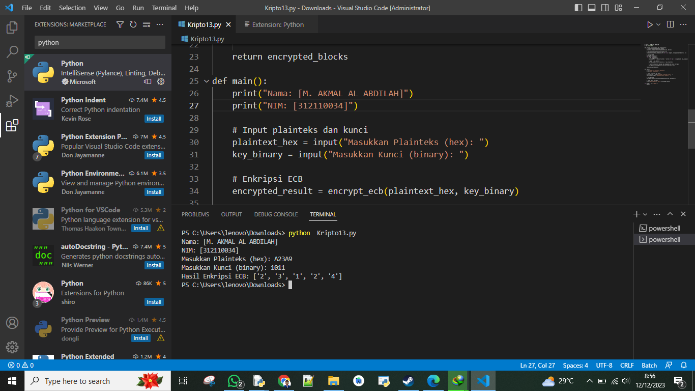

# Kriptografi Pertemuan 13


## Profil
| #               | Biodata                      |
| --------------- | ---------------------------- |
| **Nama**        | M. AKMAL AL ABDILAH          |
| **NIM**         | 312110034                    |
| **Kelas**       | TI.21.A.1                    |
| **Mata Kuliah** | Kriptografi                  |


<hr>

<p align="center">
 
</p>
<p align="center">
<a href="https://github.com/akmalabdilah"></a>
<p align="center">


<hr>


<hr>

## Tugas

<p>
Printah

contoh proses enkripsi :
Plaintek dalam  biner : 10100010001110101001
Misalkan kunci (K) yang di gunakan adalah (panjangnya juga 4 bit) yaitu : 1011 atau dalam HEX 
adalah B 

Penyelesaian:
Karena Key yang di gunakan terdiri dari 4 bit, maka terlebih dahulu bagi plaintek menjadi beberapa blok berukuran 4 bit:
1010 0010 0011 1010 1001
Atau dalam notasi HEXADESIMAL adalah A23A9
cara mengenkripsi adalah dengan XOR-kan blok plinteks Pi dengan K, kemudian geser secara wraping bit-bit dari pi XOR K satu posisi ke kiri.

Plaintek : 1010 0010 0011 1010 1001
Key : 1011 1011 1011 1011 1011
Hasil XOR: 0001 1001 1000 0001 0010
Geser 1 bit kekiri : 0010 0011 0001 0010 0100
Dalam notasi HEX: 2 3 1 2 4

Algiritma:
1. Masukan plainteks dalam hexadesimal
2. Mauskan kunci binner
3. Rubah plainteks hexadesimal ke binner
4. Setelah binner, pisah perblok 4 bit seusai panjang blok
5.  Xorkan binner palinteks perblok dengan kunci
6. Geser tiap blok 1 bit kekiri
7. Hasil xor konversi ke hexadesimal

Tugas 

Buat program python ecb seperti gambar berikut:

PS C:\Users\dwiaj\Downloads\kripto11\>python .\ecb.py
Masukan Plainteks : A23A9
Masukan Kunci: 1011
Hasil Enkripsi ecb : ['2', '3', '1', '2', '4']

Jangan lupa cetak nama dan nim di awal program !!
</p>


<hr>

<p>


<b>Kode Python</b>

```py
# Nama: M. AKMAL AL ABIDILAH
# NIM: 312110034

def encrypt_ecb(plaintext_hex, key_binary):
    # Konversi plaintext hex ke binary
    plaintext_binary = bin(int(plaintext_hex, 16))[2:]

    # Bagi plainteks menjadi blok-blok 4 bit
    blocks = [plaintext_binary[i:i+4] for i in range(0, len(plaintext_binary), 4)]

    # Enkripsi ECB
    encrypted_blocks = []
    for block in blocks:
        # XOR dengan kunci
        xor_result = ''.join(str(int(b) ^ int(k)) for b, k in zip(block, key_binary))

        # Geser 1 bit ke kiri
        shifted_result = xor_result[1:] + xor_result[0]

        # Konversi hasil ke desimal dan tambahkan ke hasil enkripsi
        encrypted_blocks.append(str(int(shifted_result, 2)))

    return encrypted_blocks

def main():
    print("Nama: [M. AKMAL AL ABDILAH]")
    print("NIM: [312110034]")

    # Input plainteks dan kunci
    plaintext_hex = input("Masukkan Plainteks (hex): ")
    key_binary = input("Masukkan Kunci (binary): ")

    # Enkripsi ECB
    encrypted_result = encrypt_ecb(plaintext_hex, key_binary)

    # Cetak hasil enkripsi
    print("Hasil Enkripsi ECB:", encrypted_result)

if __name__ == "__main__":
    main()

```


<h2>Foto hasil run Kode </h2>



<p>
 sekian and selesai.
</p>

<div>
<h2 align="center">Thanks For Reading!!!</h2>
<div align="center">

